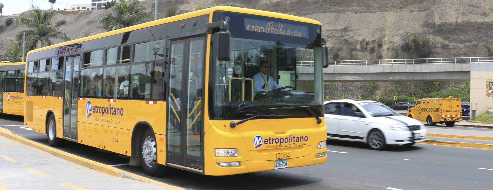
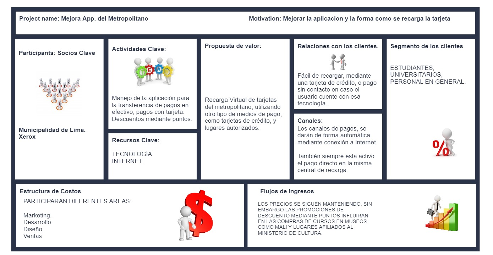
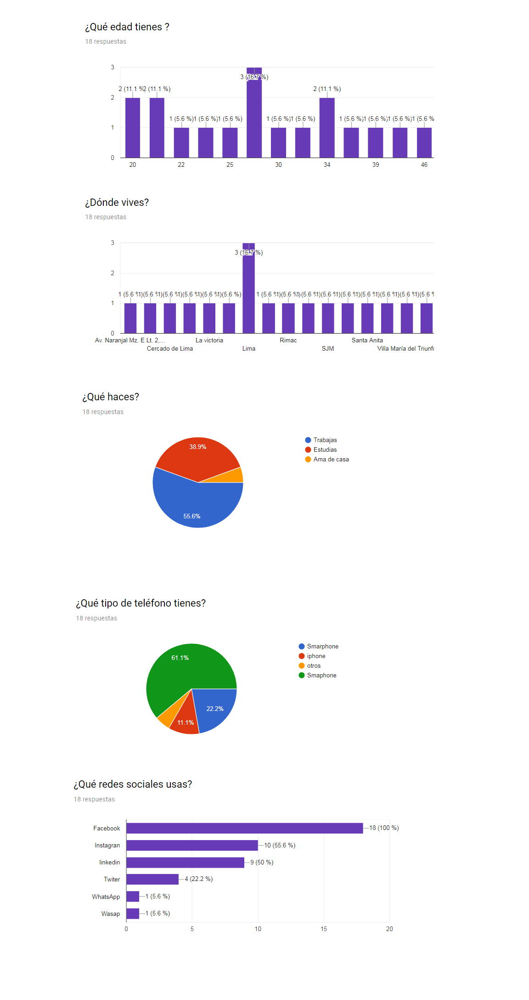
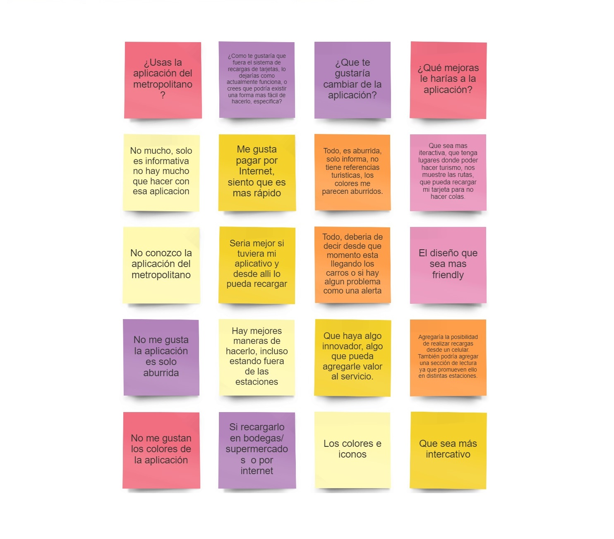

# Metropolitano
 

### Mejora App. del Metropolitano

### Planeamiento
### Vista desde Negocio.
### Programación 1era reunión Kick Off.
Reunión con los stakholders, para definir el rediseño del producto.

### Stackholders
- Personal CEO.
- Equipo de Desarrollo.
- Equipo de Diseño.
- Usuarios.
- Equipo de Marketing.
- Equipo de Contabilidad.

### Diseño Canvas
 

### Desarrollo Estadístico

### Cuestionario de Preguntas.

Num | Pregunta
----|----------------------------------------------------------------------------------------
 1 | ¿Cómo te llamas ?
 2 | ¿Qué edad tienes ?
 3 | ¿Dónde vives?
 4 | ¿Qué haces?
 5 | ¿Dónde? (Por favor especifica el lugar, Ejemplo: trabajo en Kfc la molina)
 6 | ¿Qué tipo de teléfono tienes?
 7 | ¿Qué redes sociales usas? | 
 8 | ¿Cuéntas con alguna tarjeta bancaria?
 9 | ¿Indica en que banco o bancos?
10 | ¿Utilizas tu tarjeta para hacer compras por internet?
11 | ¿Utilizas el servicio del metropolitano?
12 | ¿Con qué frecuencia?(Por favor escribe la cantidad de días a la semana que usas el metropolitano y si lo usas de ida y vuelta)
13 | ¿Cuántas veces recargas tu tarjeta?
14 | ¿Cuánto tiempo demoras en hacer la recarga?
15 | Tuviste alguna mala experiencia al momento de hacer tu recarga de tarjeta, ¿podrías contarme tu experiencia?
16 | ¿Como te gustaría que fuera el sistema de recargas de tarjetas, lo dejarías como actualmente funciona, o crees que podría existir        una forma mas fácil de hacerlo, especifica?
17 | ¿Conoces algún otro sistemas de recarga, que TÚ crees que podría funcionar en la recarga de la tarjeta del metropolitano ?, si, no     ¿Porqué?
18 | ¿Utilizas el servicio del metropolitano?
19 | Si contestaste SI o NO; especifica ¿Porqué?
20 | Si conoces la aplicación del metropolitano contesta¿Crees que la aplicación satisface tus necesidades?
21 | ¿Que te gustaría cambiar de la aplicación?
22 |¿Qué mejoras le harías a la aplicación?
23 | ¿Cuéntas con alguna tarjeta bancaria?
24 | ¿Usarías una aplicación que te facilite la forma y el servicio que el metropolitano actualmente brinda, por ejemplo quizás cargar        tu tarjeta de forma automática mediante tu celular, o mediante un plan, comentame?

### Affinity Map

### Problem Statement

- Problemas:
  - Desconocen la aplicación del metropolitano.
  - La aplicación del metropolitano no es funcional.
  - Disconformidad al momento de hacer las recargas, los usuarios presentan al menos 1 experiencia donde pierden su dinero.
  
### User Person

