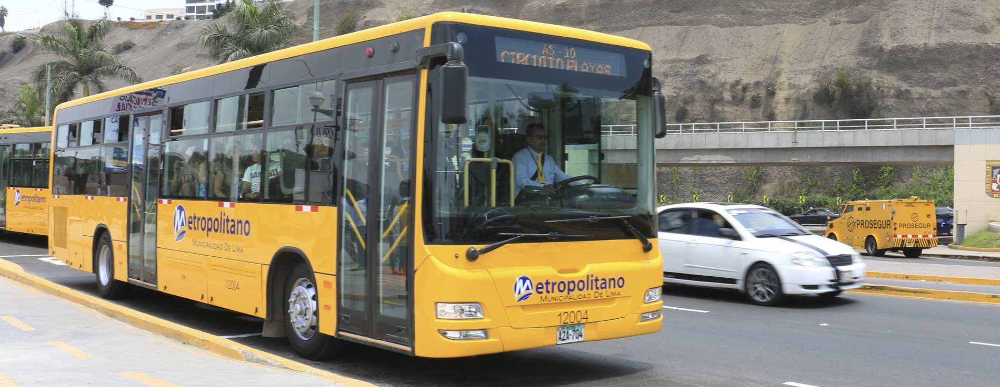
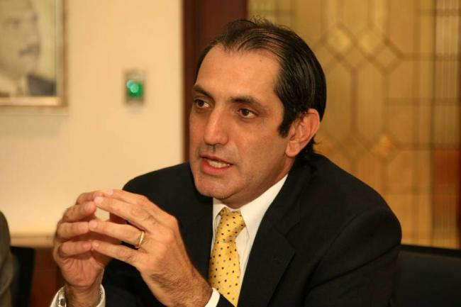
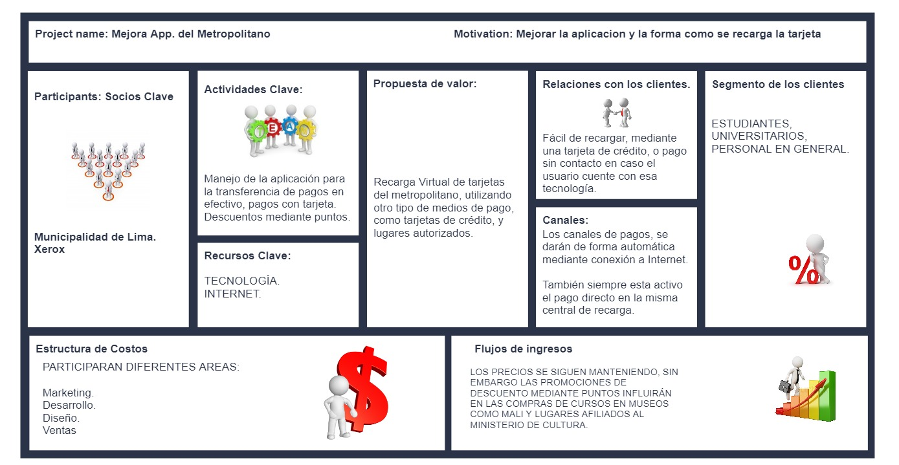
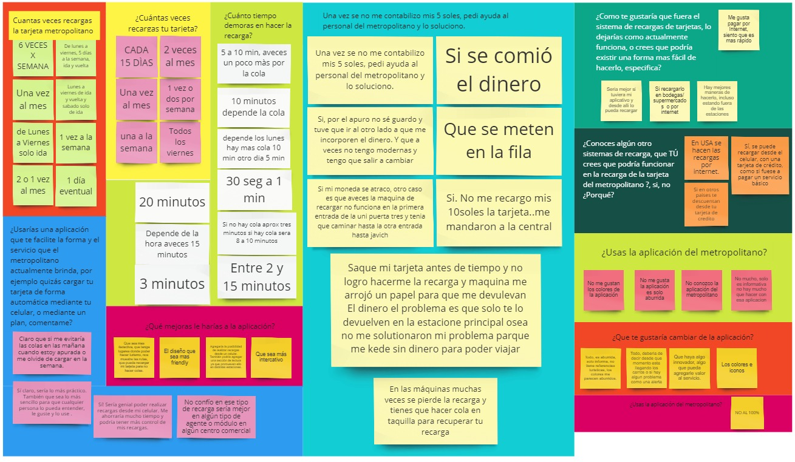
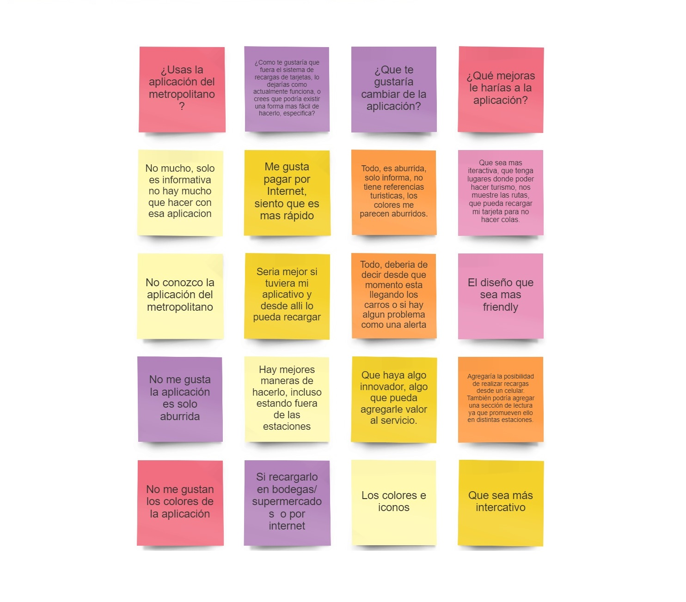
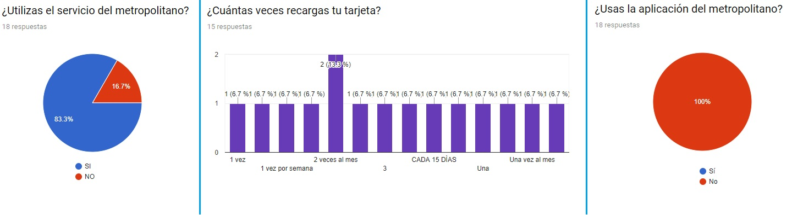

#Metropolitano
 

### Mejora App. del Metropolitano

### Planeamiento
#### Vista desde Negocio.
#### Programación 1era reunión Kick Off.
Reunión con los stakholders, para definir el rediseño del producto.

#### STAKHOLDERS
 

- Personal CEO.
- Equipo de Desarrollo.
- Equipo de Diseño.
- Usuarios.
- Equipo de Marketing.
- Equipo de Contabilidad.

#### Diseño Canvas
 

#### AFFINITY MAP

#### Problem Statement

#### Desarrollo Estadístico

- Problemas:
  - Desconocen la aplicación del metropolitano.
  - La aplicación del metropolitano no es funcional.
  - Disconformidad al momento de hacer las recargas, los usuarios presentan al menos 1 experiencia donde pierden su dinero.
  
#### USER PERSONA

